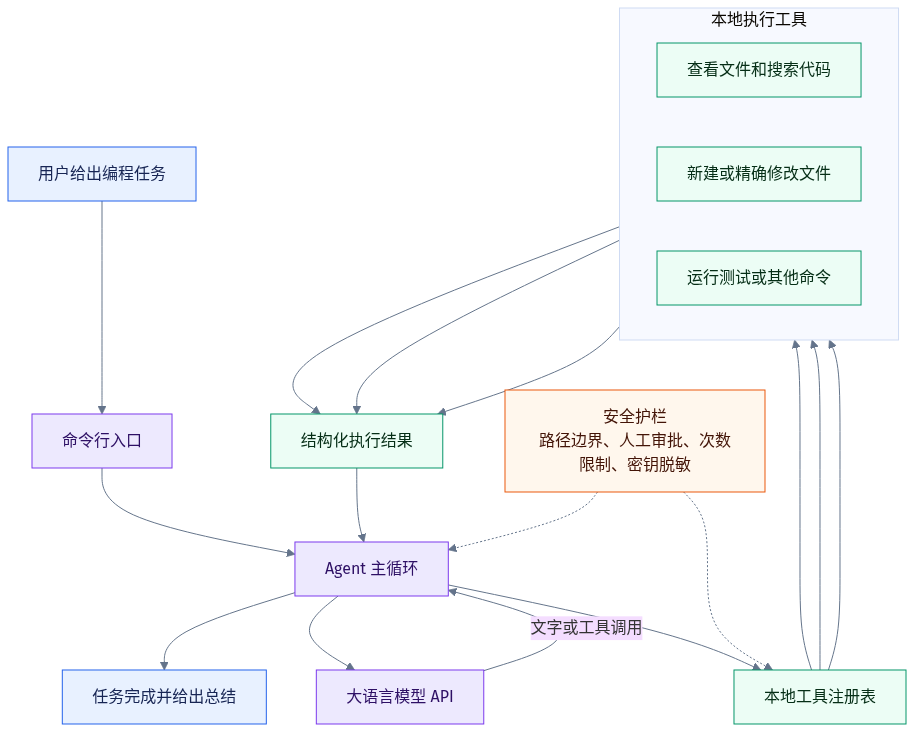

# Coding Agent from Scratch

一个用 Python 从零实现的轻量编程智能体。它不依赖任何 Agent 框架或 Agent SDK，核心目标是把“模型如何决定下一步、工具如何在本地执行、结果如何回到模型”完整而清楚地展示出来。

一句话概括运行过程：

> 收到任务 → 模型选择工具 → 本地执行 → 结果返回模型 → 重复直到完成

## 它能做什么

- 递归列出项目文件、分页读取文本、搜索代码。
- 新建文件或进行可核对的精确文本修改。
- 运行测试和其他非交互命令，并把输出交还模型分析。
- 通过本地浏览器任务台查看时间线、检查差异、逐项审批和停止任务。
- 在连接失败、限流或服务端临时错误时进行有限重试。
- 控制上下文大小，保存经过脱敏的可选会话记录。
- 在模型重复相同操作、超过轮数或工具次数时主动停止。

## 系统结构



核心代码按职责拆分：`agent.py` 管理循环，`providers/` 连接模型，`tools/` 执行本地操作，`workspace.py` 负责路径与敏感文件保护，`context.py` 控制发送给模型的历史，`web/` 只负责本地页面、运行状态和人工审批。命令行与网页共用 `runtime.py` 创建同一个 Agent，不会形成两套行为。

## 快速开始

要求 Python 3.10 或更高版本。程序运行时只使用 Python 标准库。

在仓库根目录执行：

```powershell
Copy-Item .env.example .env
```

在本地 `.env` 中填写：

```text
CODING_AGENT_API_KEY=你的密钥
CODING_AGENT_BASE_URL=兼容接口的/v1地址
CODING_AGENT_MODEL=模型名称
```

使用 DeepSeek V4 时可以直接填写：

```text
CODING_AGENT_API_KEY=你的DeepSeek密钥
CODING_AGENT_BASE_URL=https://api.deepseek.com
CODING_AGENT_MODEL=deepseek-v4-flash
CODING_AGENT_REQUEST_TIMEOUT=120
```

连接 DeepSeek 官方 V4 接口时，客户端会自动关闭默认思考模式，继续使用容易理解、延迟更低的标准工具调用流程。这个兼容选项只会发送给官方 DeepSeek V4 地址，不会影响其他 OpenAI 兼容接口。

检查配置（不会发送 API 请求）：

```powershell
python -m coding_agent doctor
```

启动浏览器任务台（推荐用于演示）：

```powershell
python -m coding_agent web --workspace examples/inventory_reservation --env-file .env
```

服务只监听 `127.0.0.1`。页面只显示工作区名称，不显示完整电脑路径；关闭终端或按 `Ctrl+C` 即可停止服务。也可以继续使用命令行运行内置演示任务：

```powershell
python -m coding_agent run "请修复当前项目中的失败测试。不要修改测试，最后再次运行测试确认全部通过。" --workspace examples/inventory_reservation --env-file .env
```

默认情况下，只读操作会自动运行，修改文件和执行命令都会询问。`--yes` 只自动批准文件修改，命令仍需确认；`--yes-all` 会批准所有操作，只能用于没有凭据、完全可信且隔离的工作区。

## 演示项目

[`examples/inventory_reservation`](examples/inventory_reservation) 模拟“订单一次预留多种库存”的业务。初始实现会在后续商品库存不足时留下部分扣减，因此有一项测试失败。合理修复需要先检查全部库存，再统一扣减，适合在两分钟内完整展示：

1. 初始测试失败。
2. 智能体查看多个文件并定位原因。
3. 智能体修改业务代码。
4. 智能体重新运行测试并确认通过。

## 安全边界

- 所有模型给出的文件路径必须位于指定工作区。
- `.env`、`.git`、会话目录和常见凭据文件不能被文件工具读取或修改。
- 已知 API Key 会在任务、模型回答、工具结果、命令输出和会话记录中脱敏。
- 写入采用原子替换；精确编辑默认拒绝零匹配或多匹配。
- 命令使用参数数组和固定工作目录，不经过 shell，并限制时间与输出大小。
- 每轮工具结果有大小预算，避免一次输出挤满上下文。
- 浏览器服务只绑定本机地址，并校验页面令牌、`Host` 和 `Origin`；模型密钥不会发送到前端。

命令审批不是操作系统级沙箱。获批命令仍可能访问工作区之外的资源，因此不要对不可信项目使用 `--yes-all`，并尽量把模型配置文件放在目标工作区之外。

## 测试

```powershell
python -m unittest discover -s tests -v
```

测试全部离线运行。其中端到端测试会启动本地假模型 HTTP 服务，通过正式命令行流程读取含 Bug 的项目、修改代码、运行测试并结束，不消耗真实模型额度。

## 设计资料

- [开发路线](docs/ROADMAP.md)
- [面试设计说明](docs/INTERVIEW_NOTES.md)
- [两分钟视频脚本](docs/VIDEO_SCRIPT.md)
- [一分钟英文介绍](docs/ENGLISH_INTRO.md)
- [提交前检查表](docs/SUBMISSION_CHECKLIST.md)

## 参考方式

项目研究了 `shareAI-lab/learn-claude-code`、`SWE-agent/mini-swe-agent` 和 `rasbt/mini-coding-agent` 的设计取舍，但源码从空仓库独立实现，也不调用任何现成 Agent 运行时。
